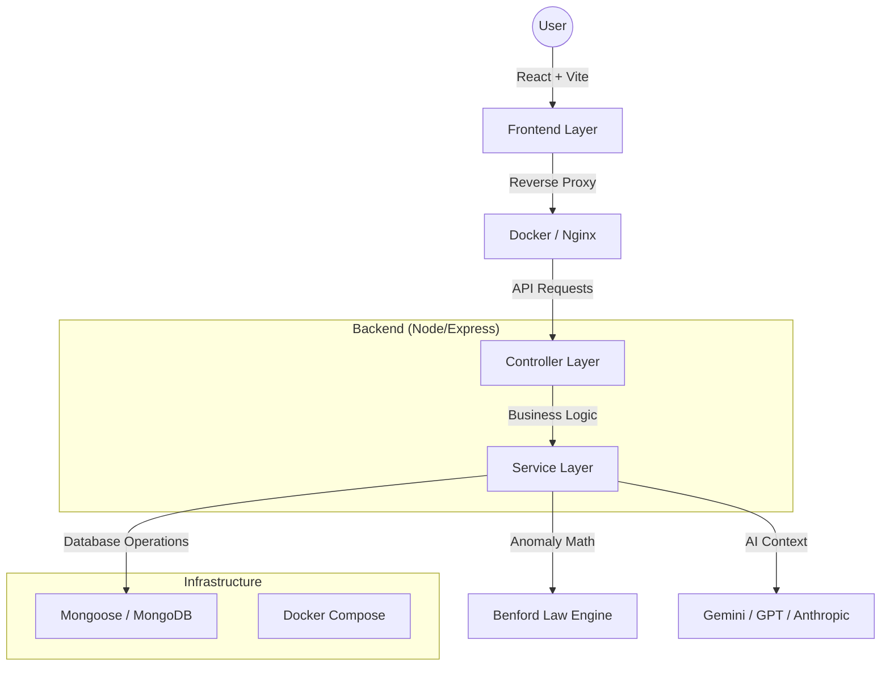

# 📊 ExpenseAudit AI – Enterprise Financial Anomaly Detection

**An AI-powered platform for financial anomaly detection using Benford’s Law, intelligent dashboards, and multi-LLM generated summaries. Designed for production-grade auditing.**

---

## 🏗️ System Architecture

ExpenseAudit AI follows a modern **Controller-Service** architecture to ensure scalability, testability, and clean separation of concerns.



---

## 🚀 Professional Features

### 🛠️ Enterprise Engineering

- **State-of-the-Art Architecture**: Controller-Service pattern for clean modular code.
- **Robust Authentication**: JWT + Google OAuth 2.0 (Passport.js) for secure, modern access.
- **Global Error Handling**: Centralized middleware for production-grade reliability.
- **Containerization**: Full Docker support for one-click environment setup.

### ☸️ Enterprise Orchestration

- **Docker Compose**: One-click local development with orchestrated containers.
- **Kubernetes (K8s) Ready**: Production-grade manifests for auto-scaling, self-healing pods, and secure secret management.

### 📈 Advanced Analytics

- **Benford's Law Engine**: Mathematical digit distribution analysis for fraud detection.
- **Suspicious Transaction Flagging**: Automated risk scoring for vendors and transactions.
- **Multi-LLM Summaries**: AI interpretations powered by Gemini, GPT-4, and Claude.
- **Audit-Ready PDF Reports**: High-fidelity reports with interactive data visualizations.

---

## 🔑 Required API Keys & Connections

To run ExpenseAudit AI, you need to configure connection parameters and API keys. 

Create a `.env` file in the `server` directory and root directory (using the templates provided in `server/.env.example` and `.env`).

### 1. Backend Service Keys (`server/.env`)

1. **MongoDB Connection (`MONGODB_URI`)**:
   * **Purpose**: Database for storing transaction audits, user accounts, and activity logs.
   * **Where to get**: Use a local instance (`mongodb://localhost:27017/expenseaudit-ai`) or create a free cloud database on [MongoDB Atlas](https://www.mongodb.com/cloud/atlas).
2. **Google OAuth Credentials (`GOOGLE_CLIENT_ID`, `GOOGLE_CLIENT_SECRET`)**:
   * **Purpose**: Enables sign-in with Google functionality.
   * **Where to get**: Go to the [Google Cloud Console](https://console.cloud.google.com/), create a project, set up your OAuth consent screen, and create OAuth client IDs. Add `http://localhost:5000/api/auth/google/callback` to the Authorized Redirect URIs.
3. **Session & JWT Secrets (`JWT_SECRET`, `JWT_REFRESH_SECRET`, `SESSION_SECRET`)**:
   * **Purpose**: Cryptographic keys for signing JWT tokens and user session cookies.
   * **Setup**: Run `openssl rand -base64 32` in your terminal to generate secure 32-character strings.
4. **Stripe Secrets (`STRIPE_SECRET_KEY`, `STRIPE_WEBHOOK_SECRET`)**:
   * **Purpose**: Handles checkout flows and webhook event synchronization for subscriptions.
   * **Where to get**: [Stripe Developer Dashboard](https://dashboard.stripe.com/).
5. **Stripe Product Price IDs (`STRIPE_FREE_PRICE_ID`, `STRIPE_PRO_MONTHLY_PRICE_ID`, etc.)**:
   * **Purpose**: Syncs subscription levels (Free, Pro, Enterprise) with Stripe.
   * **Where to get**: Create subscription products in Stripe, configure their pricing tiers, and copy the Price IDs (e.g. `price_1P...`).
6. **Gemini API Key (`GEMINI_API_KEY`)**:
   * **Purpose**: Used for generating AI-powered financial summary interpretations.
   * **Where to get**: [Google AI Studio](https://aistudio.google.com/).
7. **Ollama Integration (`DEFAULT_OLLAMA_MODEL` / `OLLAMA_BASE_URL`)**:
   * **Purpose**: Optional setup if you prefer routing summaries to a local LLM model (e.g., `llama3` running locally via Ollama).
8. **SMTP Credentials (`SMTP_HOST`, `SMTP_PORT`, `SMTP_USER`, `SMTP_PASS`)**:
   * **Purpose**: Sends billing invoice emails, confirmation alerts, and reports.
   * **Where to get**: Generate a Google App Password or use an email testing sandbox like Mailtrap.

### 2. Frontend Configuration (`.env` & `src/.env`)

Configure the following variables in the root and frontend source directories:
* **`VITE_STRIPE_PUBLISHABLE_KEY`**: Your Stripe Publishable key (from Stripe Developer Dashboard).
* **`VITE_API_URL`**: `http://localhost:5000/api` (points to the backend API layer).
* **`VITE_API_BASE_URL`**: `http://localhost:5000`

---

## 🐳 Getting Started (Docker)

The fastest way to run ExpenseAudit AI is using Docker Compose.

1. **Clone and Configure**:

   ```bash
   cp server/.env.example server/.env
   # Edit server/.env with your API keys
   ```

2. **Spin Up Containers**:

   ```bash
   docker-compose up --build
   ```

3. **Access the App**:
   - Frontend: `http://localhost:5173`
   - Backend: `http://localhost:5000`

---

## ☸️ Enterprise Orchestration (Kubernetes)

> **🚀 Want to see the Enterprise Version?**
> Switch to the `feature/enterprise-orchestration` branch to see full Kubernetes & Redis implementation.

---

## 🧪 Quality Assurance & Testing

We maintain high code quality through automated unit testing of our core mathematical logic.

### Running Backend Tests

```bash
cd server
npm test
```

_Tests cover: Leading digit extraction, Mean Absolute Deviation (MAD), and compliance threshold assessments._

---

## ⚙️ Development Setup (No Docker)

### Prerequisites

- Node.js v20.x
- MongoDB (Running locally or via Atlas)

### Setup

1. **Frontend**:
   ```bash
   npm install
   npm run dev
   ```
2. **Backend**:
   ```bash
   cd server
   npm install
   npm run dev
   ```

---

## 🛡️ Security

- **Data Privacy**: Raw financial data is processed in-memory and never permanently stored.
- **Encrypted Secrets**: AI API keys are encrypted at rest using AES-256.
- **Rate Limiting**: Protection against brute-force and DDoS on all API endpoints.

---

## 📄 License

MIT License - Developed for professional auditing and compliance transparency.
