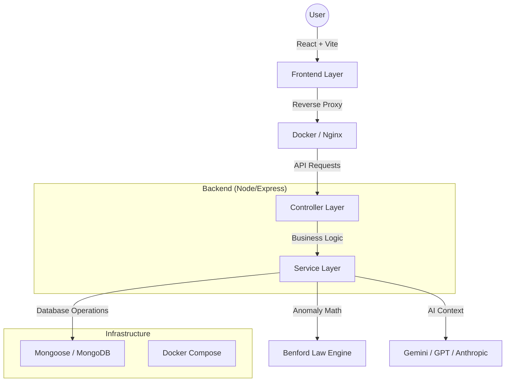

# 📊 ExpenseAudit AI – Enterprise Financial Anomaly Detection

**An AI-powered platform for financial anomaly detection using Benford’s Law, intelligent dashboards, and multi-LLM generated summaries. Designed for production-grade auditing.**

---

## 🏗️ System Architecture

ExpenseAudit AI follows a modern **Controller-Service** architecture to ensure scalability, testability, and clean separation of concerns.



---

## 🚀 Professional Features

### 🛠️ Enterprise Engineering

- **State-of-the-Art Architecture**: Controller-Service pattern for clean modular code.
- **Robust Authentication**: JWT + Google OAuth 2.0 (Passport.js) for secure, modern access.
- **Global Error Handling**: Centralized middleware for production-grade reliability.
- **Containerization**: Full Docker support for one-click environment setup.

### ☸️ Enterprise Orchestration

- **Docker Compose**: One-click local development with orchestrated containers.
- **Kubernetes (K8s) Ready**: Production-grade manifests for auto-scaling, self-healing pods, and secure secret management.

### 📈 Advanced Analytics

- **Benford's Law Engine**: Mathematical digit distribution analysis for fraud detection.
- **Suspicious Transaction Flagging**: Automated risk scoring for vendors and transactions.
- **Multi-LLM Summaries**: AI interpretations powered by Gemini, GPT-4, and Claude.
- **Audit-Ready PDF Reports**: High-fidelity reports with interactive data visualizations.

---

## 🐳 Getting Started (Docker)

The fastest way to run ExpenseAudit AI is using Docker Compose.

1. **Clone and Configure**:

   ```bash
   cp server/.env.example server/.env
   # Edit server/.env with your API keys
   ```

2. **Spin Up Containers**:

   ```bash
   docker-compose up --build
   ```

3. **Access the App**:
   - Frontend: `http://localhost:5173`
   - Backend: `http://localhost:5000`

---

## ☸️ Enterprise Orchestration (Kubernetes)

> **🚀 Want to see the Enterprise Version?**
> Switch to the `feature/enterprise-orchestration` branch to see full Kubernetes & Redis implementation.

---

## 🧪 Quality Assurance & Testing

We maintain high code quality through automated unit testing of our core mathematical logic.

### Running Backend Tests

```bash
cd server
npm test
```

_Tests cover: Leading digit extraction, Mean Absolute Deviation (MAD), and compliance threshold assessments._

---

## ⚙️ Development Setup (No Docker)

### Prerequisites

- Node.js v20.x
- MongoDB (Running locally or via Atlas)

### Setup

1. **Frontend**:
   ```bash
   npm install
   npm run dev
   ```
2. **Backend**:
   ```bash
   cd server
   npm install
   npm run dev
   ```

---

## 🛡️ Security

- **Data Privacy**: Raw financial data is processed in-memory and never permanently stored.
- **Encrypted Secrets**: AI API keys are encrypted at rest using AES-256.
- **Rate Limiting**: Protection against brute-force and DDoS on all API endpoints.

---

## 📄 License

MIT License - Developed for professional auditing and compliance transparency.
